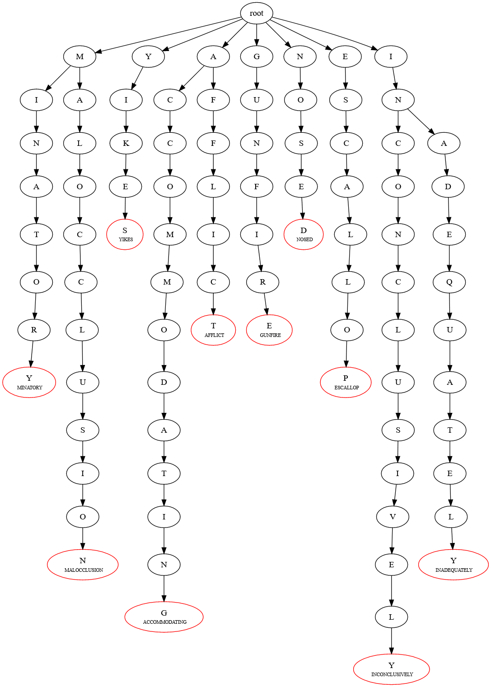
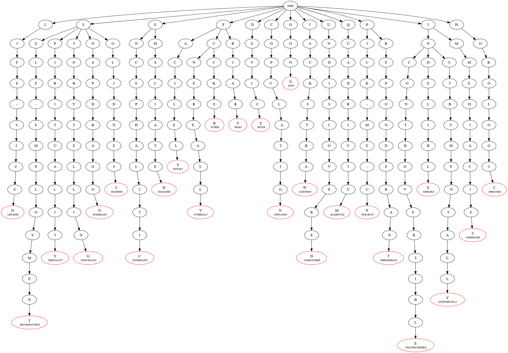
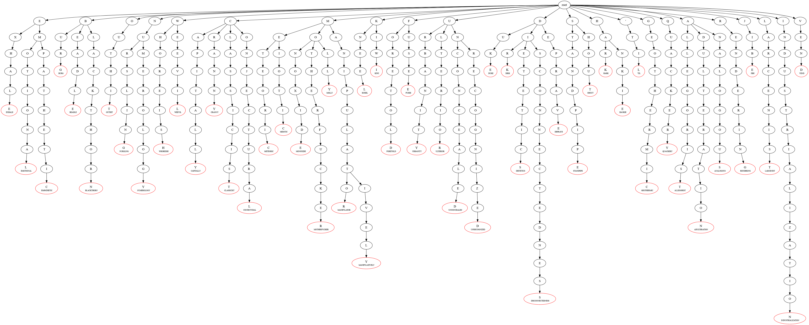

<h1 align="center">CSCTrie</h1>
<h2 align="center">Trie dotfile images</h2>

<p align="center">So we made some changes to how our dotfile outputs images.  The leaf nodes are now read and show the entire word along with the leaf character.
The read.me shows some earlier versions of the dot images.  He the dotfile will be posted along with the image for further clarification.
 
</p>

```Graphviz
 strict digraph G {
rootNode [label="root"]
//MINATORY
node007EC888 [label=<M>]
node007AEAE8 [label=<I>]
node007AAD78 [label=<N>]
node007AAFB0 [label=<A>]
node007AB1E8 [label=<T>]
node007AB420 [label=<O>]
node007AB658 [label=<R>]
node007AB890 [label=<Y<BR /> <FONT POINT-SIZE="8">MINATORY</FONT>> ,color=<red>]
rootNode -> node007EC888 -> node007AEAE8 -> node007AAD78 -> node007AAFB0 -> node007AB1E8 -> node007AB420 -> node007AB658 -> node007AB890

//YIKES
node007D7558 [label=<Y>]
node007D7790 [label=<I>]
node007D79C8 [label=<K>]
node007D7C00 [label=<E>]
node007D7E38 [label=<S<BR /> <FONT POINT-SIZE="8">YIKES</FONT>> ,color=<red>]
rootNode -> node007D7558 -> node007D7790 -> node007D79C8 -> node007D7C00 -> node007D7E38

//ACCOMMODATING
node007D8070 [label=<A>]
node007A4760 [label=<C>]
node007A4998 [label=<C>]
node00AC4BC8 [label=<O>]
node00AC4E10 [label=<M>]
node00AC5058 [label=<M>]
node00AC4738 [label=<O>]
node00AC52A0 [label=<D>]
node00AC4980 [label=<A>]
node00AC54E8 [label=<T>]
node00AC5BC0 [label=<I>]
node00AC44F0 [label=<N>]
node00AC5730 [label=<G<BR /> <FONT POINT-SIZE="8">ACCOMMODATING</FONT>> ,color=<red>]
rootNode -> node007D8070 -> node007A4760 -> node007A4998 -> node00AC4BC8 -> node00AC4E10 -> node00AC5058 -> node00AC4738 -> node00AC52A0 -> node00AC4980 -> node00AC54E8 -> node00AC5BC0 -> node00AC44F0 -> node00AC5730

//AFFLICT
node007D8070 [label=<A>]
node00AC5978 [label=<F>]
node00AC4060 [label=<F>]
node00AC42A8 [label=<L>]
node007A9698 [label=<I>]
node007A8458 [label=<C>]
node007A9450 [label=<T<BR /> <FONT POINT-SIZE="8">AFFLICT</FONT>> ,color=<red>]
rootNode -> node007D8070 -> node00AC5978 -> node00AC4060 -> node00AC42A8 -> node007A9698 -> node007A8458 -> node007A9450

//GUNFIRE
node007A6468 [label=<G>]
node007A6FD0 [label=<U>]
node007A7218 [label=<N>]
node007A7D80 [label=<F>]
node007A98E0 [label=<I>]
node007A9B28 [label=<R>]
node007A5D90 [label=<E<BR /> <FONT POINT-SIZE="8">GUNFIRE</FONT>> ,color=<red>]
rootNode -> node007A6468 -> node007A6FD0 -> node007A7218 -> node007A7D80 -> node007A98E0 -> node007A9B28 -> node007A5D90

//NOSED
node007A8FC0 [label=<N>]
node007A88E8 [label=<O>]
node007A8B30 [label=<S>]
node007A5FD8 [label=<E>]
node007A6220 [label=<D<BR /> <FONT POINT-SIZE="8">NOSED</FONT>> ,color=<red>]
rootNode -> node007A8FC0 -> node007A88E8 -> node007A8B30 -> node007A5FD8 -> node007A6220

//MALOCCLUSION
node007EC888 [label=<M>]
node007A7FC8 [label=<A>]
node007A68F8 [label=<L>]
node007A66B0 [label=<O>]
node007A6B40 [label=<C>]
node007A7B38 [label=<C>]
node007A6D88 [label=<L>]
node007A78F0 [label=<U>]
node007A8210 [label=<S>]
node007A7460 [label=<I>]
node007A76A8 [label=<O>]
node007A86A0 [label=<N<BR /> <FONT POINT-SIZE="8">MALOCCLUSION</FONT>> ,color=<red>]
rootNode -> node007EC888 -> node007A7FC8 -> node007A68F8 -> node007A66B0 -> node007A6B40 -> node007A7B38 -> node007A6D88 -> node007A78F0 -> node007A8210 -> node007A7460 -> node007A76A8 -> node007A86A0

//ESCALLOP
node007A8D78 [label=<E>]
node007A9208 [label=<S>]
node00C08298 [label=<C>]
node00C0ADF0 [label=<A>]
node00C0ABA8 [label=<L>]
node00C0B038 [label=<L>]
node00C0A960 [label=<O>]
node00C09048 [label=<P<BR /> <FONT POINT-SIZE="8">ESCALLOP</FONT>> ,color=<red>]
rootNode -> node007A8D78 -> node007A9208 -> node00C08298 -> node00C0ADF0 -> node00C0ABA8 -> node00C0B038 -> node00C0A960 -> node00C09048

//INCONCLUSIVELY
node00C0B4C8 [label=<I>]
node00C0A4D0 [label=<N>]
node00C0BBA0 [label=<C>]
node00C09290 [label=<O>]
node00C08BB8 [label=<N>]
node00C084E0 [label=<C>]
node00C094D8 [label=<L>]
node00C08728 [label=<U>]
node00C09720 [label=<S>]
node00C0B280 [label=<I>]
node00C0B710 [label=<V>]
node00C08970 [label=<E>]
node00C08E00 [label=<L>]
node00C0A288 [label=<Y<BR /> <FONT POINT-SIZE="8">INCONCLUSIVELY</FONT>> ,color=<red>]
rootNode -> node00C0B4C8 -> node00C0A4D0 -> node00C0BBA0 -> node00C09290 -> node00C08BB8 -> node00C084E0 -> node00C094D8 -> node00C08728 -> node00C09720 -> node00C0B280 -> node00C0B710 -> node00C08970 -> node00C08E00 -> node00C0A288

//INADEQUATELY
node00C0B4C8 [label=<I>]
node00C0A4D0 [label=<N>]
node00C09968 [label=<A>]
node00C09BB0 [label=<D>]
node00C09DF8 [label=<E>]
node00C0BDE8 [label=<Q>]
node00C0A040 [label=<U>]
node00C0A718 [label=<A>]
node00C0B958 [label=<T>]
node00C08050 [label=<E>]
node00B83BB0 [label=<L>]
node00B81058 [label=<Y<BR /> <FONT POINT-SIZE="8">INADEQUATELY</FONT>> ,color=<red>]
rootNode -> node00C0B4C8 -> node00C0A4D0 -> node00C09968 -> node00C09BB0 -> node00C09DF8 -> node00C0BDE8 -> node00C0A040 -> node00C0A718 -> node00C0B958 -> node00C08050 -> node00B83BB0 -> node00B81058

}

```



<br>
<br>

```
 strict digraph G {
rootNode [label="root"]
//LIFE-SIZED
node00B83048 [label=<L>]
node00B82298 [label=<I>]
node00B84040 [label=<F>]
node00B83DF8 [label=<E>]
node00B824E0 [label=<->]
node00B82728 [label=<S>]
node00B83290 [label=<I>]
node00B834D8 [label=<Z>]
node00B83720 [label=<E>]
node00B84718 [label=<D<BR /> <FONT POINT-SIZE="8">LIFE-SIZED</FONT>> ,color=<red>]
rootNode -> node00B83048 -> node00B82298 -> node00B84040 -> node00B83DF8 -> node00B824E0 -> node00B82728 -> node00B83290 -> node00B834D8 -> node00B83720 -> node00B84718

//SELF-EMPLOYMENT
node00B82050 [label=<S>]
node00B82970 [label=<E>]
node00B844D0 [label=<L>]
node00B84BA8 [label=<F>]
node00B812A0 [label=<->]
node00B82BB8 [label=<E>]
node00B81730 [label=<M>]
node00B84960 [label=<P>]
node00B81978 [label=<L>]
node00B81BC0 [label=<O>]
node00B81E08 [label=<Y>]
node00B84DF0 [label=<M>]
node00B84288 [label=<E>]
node00B82E00 [label=<N>]
node00B83968 [label=<T<BR /> <FONT POINT-SIZE="8">SELF-EMPLOYMENT</FONT>> ,color=<red>]
rootNode -> node00B82050 -> node00B82970 -> node00B844D0 -> node00B84BA8 -> node00B812A0 -> node00B82BB8 -> node00B81730 -> node00B84960 -> node00B81978 -> node00B81BC0 -> node00B81E08 -> node00B84DF0 -> node00B84288 -> node00B82E00 -> node00B83968

//ENCEPHALITIC
node007E9090 [label=<E>]
node007E9E40 [label=<N>]
node007EB2C8 [label=<C>]
node007EBE30 [label=<E>]
node007EAE38 [label=<P>]
node007E9768 [label=<H>]
node007EC078 [label=<A>]
node007E8E48 [label=<L>]
node007EB080 [label=<I>]
node007E8770 [label=<T>]
node007E8528 [label=<I>]
node007E89B8 [label=<C<BR /> <FONT POINT-SIZE="8">ENCEPHALITIC</FONT>> ,color=<red>]
rootNode -> node007E9090 -> node007E9E40 -> node007EB2C8 -> node007EBE30 -> node007EAE38 -> node007E9768 -> node007EC078 -> node007E8E48 -> node007EB080 -> node007E8770 -> node007E8528 -> node007E89B8

//FACILELY
node007EA518 [label=<F>]
node007EBBE8 [label=<A>]
node007E99B0 [label=<C>]
node007EB510 [label=<I>]
node007E9BF8 [label=<L>]
node007E82E0 [label=<E>]
node007E8C00 [label=<L>]
node007EA2D0 [label=<Y<BR /> <FONT POINT-SIZE="8">FACILELY</FONT>> ,color=<red>]
rootNode -> node007EA518 -> node007EBBE8 -> node007E99B0 -> node007EB510 -> node007E9BF8 -> node007E82E0 -> node007E8C00 -> node007EA2D0

//FUNEREALLY
node007EA518 [label=<F>]
node007E92D8 [label=<U>]
node007EA760 [label=<N>]
node007EB758 [label=<E>]
node007E9520 [label=<R>]
node007EA9A8 [label=<E>]
node007EB9A0 [label=<A>]
node007EABF0 [label=<L>]
node007EA088 [label=<L>]
node007C5DB0 [label=<Y<BR /> <FONT POINT-SIZE="8">FUNEREALLY</FONT>> ,color=<red>]
rootNode -> node007EA518 -> node007E92D8 -> node007EA760 -> node007EB758 -> node007E9520 -> node007EA9A8 -> node007EB9A0 -> node007EABF0 -> node007EA088 -> node007C5DB0

//DEVICE
node007C3B78 [label=<D>]
node007C6918 [label=<E>]
node007C3930 [label=<V>]
node007C4008 [label=<I>]
node007C4928 [label=<C>]
node007C3258 [label=<E<BR /> <FONT POINT-SIZE="8">DEVICE</FONT>> ,color=<red>]
rootNode -> node007C3B78 -> node007C6918 -> node007C3930 -> node007C4008 -> node007C4928 -> node007C3258

//SPIRITUALITY
node00B82050 [label=<S>]
node007C6488 [label=<P>]
node007C36E8 [label=<I>]
node007C6B60 [label=<R>]
node007C66D0 [label=<I>]
node007C5248 [label=<T>]
node007C34A0 [label=<U>]
node007C56D8 [label=<A>]
node007C4B70 [label=<L>]
node007C5490 [label=<I>]
node007C6FF0 [label=<T>]
node007C3DC0 [label=<Y<BR /> <FONT POINT-SIZE="8">SPIRITUALITY</FONT>> ,color=<red>]
rootNode -> node00B82050 -> node007C6488 -> node007C36E8 -> node007C6B60 -> node007C66D0 -> node007C5248 -> node007C34A0 -> node007C56D8 -> node007C4B70 -> node007C5490 -> node007C6FF0 -> node007C3DC0

//COPULATION
node007C5FF8 [label=<C>]
node007C4250 [label=<O>]
node007C4498 [label=<P>]
node007C5920 [label=<U>]
node007C46E0 [label=<L>]
node007C5B68 [label=<A>]
node007C4DB8 [label=<T>]
node007C6240 [label=<I>]
node007C6DA8 [label=<O>]
node007C5000 [label=<N<BR /> <FONT POINT-SIZE="8">COPULATION</FONT>> ,color=<red>]
rootNode -> node007C5FF8 -> node007C4250 -> node007C4498 -> node007C5920 -> node007C46E0 -> node007C5B68 -> node007C4DB8 -> node007C6240 -> node007C6DA8 -> node007C5000

//GONG
node00B41710 [label=<G>]
node00B3F048 [label=<O>]
node00B41958 [label=<N>]
node00B3E298 [label=<G<BR /> <FONT POINT-SIZE="8">GONG</FONT>> ,color=<red>]
rootNode -> node00B41710 -> node00B3F048 -> node00B41958 -> node00B3E298

//STORYTELLING
node00B82050 [label=<S>]
node00B3EBB8 [label=<T>]
node00B3F720 [label=<O>]
node00B3FBB0 [label=<R>]
node00B3E4E0 [label=<Y>]
node00B40718 [label=<T>]
node00B3EE00 [label=<E>]
node00B3FDF8 [label=<L>]
node00B41038 [label=<L>]
node00B41BA0 [label=<I>]
node00B40BA8 [label=<N>]
node00B3F4D8 [label=<G<BR /> <FONT POINT-SIZE="8">STORYTELLING</FONT>> ,color=<red>]
rootNode -> node00B82050 -> node00B3EBB8 -> node00B3F720 -> node00B3FBB0 -> node00B3E4E0 -> node00B40718 -> node00B3EE00 -> node00B3FDF8 -> node00B41038 -> node00B41BA0 -> node00B40BA8 -> node00B3F4D8

//SNAPDRAGON
node00B82050 [label=<S>]
node00B40960 [label=<N>]
node00B40DF0 [label=<A>]
node00B3F290 [label=<P>]
node00B3F968 [label=<D>]
node00B40040 [label=<R>]
node00B41DE8 [label=<A>]
node00B40288 [label=<G>]
node00B3E050 [label=<O>]
node00B404D0 [label=<N<BR /> <FONT POINT-SIZE="8">SNAPDRAGON</FONT>> ,color=<red>]
rootNode -> node00B82050 -> node00B40960 -> node00B40DF0 -> node00B3F290 -> node00B3F968 -> node00B40040 -> node00B41DE8 -> node00B40288 -> node00B3E050 -> node00B404D0

//JACKSTRAW
node00B414C8 [label=<J>]
node00B41280 [label=<A>]
node00B3E728 [label=<C>]
node00B3E970 [label=<K>]
node00D8C4D0 [label=<S>]
node00D8AE00 [label=<T>]
node00D8A970 [label=<R>]
node00D8B968 [label=<A>]
node00D8BBB0 [label=<W<BR /> <FONT POINT-SIZE="8">JACKSTRAW</FONT>> ,color=<red>]
rootNode -> node00B414C8 -> node00B41280 -> node00B3E728 -> node00B3E970 -> node00D8C4D0 -> node00D8AE00 -> node00D8A970 -> node00D8B968 -> node00D8BBB0

//UNDISCOVERED
node00D8C040 [label=<U>]
node00D89730 [label=<N>]
node00D89E08 [label=<D>]
node00D89978 [label=<I>]
node00D8C960 [label=<S>]
node00D8CBA8 [label=<C>]
node00D8B048 [label=<O>]
node00D89BC0 [label=<V>]
node00D8CDF0 [label=<E>]
node00D8A728 [label=<R>]
node00D89058 [label=<E>]
node00D894E8 [label=<D<BR /> <FONT POINT-SIZE="8">UNDISCOVERED</FONT>> ,color=<red>]
rootNode -> node00D8C040 -> node00D89730 -> node00D89E08 -> node00D89978 -> node00D8C960 -> node00D8CBA8 -> node00D8B048 -> node00D89BC0 -> node00D8CDF0 -> node00D8A728 -> node00D89058 -> node00D894E8

//QUADRIVIUM
node00D8B290 [label=<Q>]
node00D8A050 [label=<U>]
node00D892A0 [label=<A>]
node00D8A4E0 [label=<D>]
node00D8A298 [label=<R>]
node00D8BDF8 [label=<I>]
node00D8ABB8 [label=<V>]
node00D8B4D8 [label=<I>]
node00D8C288 [label=<U>]
node00D8B720 [label=<M<BR /> <FONT POINT-SIZE="8">QUADRIVIUM</FONT>> ,color=<red>]
rootNode -> node00D8B290 -> node00D8A050 -> node00D892A0 -> node00D8A4E0 -> node00D8A298 -> node00D8BDF8 -> node00D8ABB8 -> node00D8B4D8 -> node00D8C288 -> node00D8B720

//PICK-ME-UP
node00D8C718 [label=<P>]
node007D4550 [label=<I>]
node007D27A8 [label=<C>]
node007D40C0 [label=<K>]
node007D49E0 [label=<->]
node007D1E88 [label=<M>]
node007D39E8 [label=<E>]
node007D2C38 [label=<->]
node007D1568 [label=<U>]
node007D3558 [label=<P<BR /> <FONT POINT-SIZE="8">PICK-ME-UP</FONT>> ,color=<red>]
rootNode -> node00D8C718 -> node007D4550 -> node007D27A8 -> node007D40C0 -> node007D49E0 -> node007D1E88 -> node007D39E8 -> node007D2C38 -> node007D1568 -> node007D3558

//FUCKER
node007EA518 [label=<F>]
node007E92D8 [label=<U>]
node007D29F0 [label=<C>]
node007D4E70 [label=<K>]
node007D19F8 [label=<E>]
node007D3C30 [label=<R<BR /> <FONT POINT-SIZE="8">FUCKER</FONT>> ,color=<red>]
rootNode -> node007EA518 -> node007E92D8 -> node007D29F0 -> node007D4E70 -> node007D19F8 -> node007D3C30

//INCONTROVERTIBLE
node007D2E80 [label=<I>]
node007D5300 [label=<N>]
node007D2318 [label=<C>]
node007D4308 [label=<O>]
node007D1C40 [label=<N>]
node007D20D0 [label=<T>]
node007D2560 [label=<R>]
node007D30C8 [label=<O>]
node007D3310 [label=<V>]
node007D37A0 [label=<E>]
node007D4798 [label=<R>]
node007D3E78 [label=<T>]
node007D17B0 [label=<I>]
node007D4C28 [label=<B>]
node007D50B8 [label=<L>]
node011CF038 [label=<E<BR /> <FONT POINT-SIZE="8">INCONTROVERTIBLE</FONT>> ,color=<red>]
rootNode -> node007D2E80 -> node007D5300 -> node007D2318 -> node007D4308 -> node007D1C40 -> node007D20D0 -> node007D2560 -> node007D30C8 -> node007D3310 -> node007D37A0 -> node007D4798 -> node007D3E78 -> node007D17B0 -> node007D4C28 -> node007D50B8 -> node011CF038

//IMMEDIACIES
node007D2E80 [label=<I>]
node011D0DE0 [label=<M>]
node011D04C0 [label=<M>]
node011D0708 [label=<E>]
node011D0950 [label=<D>]
node011D1028 [label=<I>]
node011D0278 [label=<A>]
node011CEBA8 [label=<C>]
node011D1DD8 [label=<I>]
node011CE960 [label=<E>]
node011D1700 [label=<S<BR /> <FONT POINT-SIZE="8">IMMEDIACIES</FONT>> ,color=<red>]
rootNode -> node007D2E80 -> node011D0DE0 -> node011D04C0 -> node011D0708 -> node011D0950 -> node011D1028 -> node011D0278 -> node011CEBA8 -> node011D1DD8 -> node011CE960 -> node011D1700

//EMACIATED
node007E9090 [label=<E>]
node011D0B98 [label=<M>]
node011D14B8 [label=<A>]
node011D1270 [label=<C>]
node011D1948 [label=<I>]
node011CFBA0 [label=<A>]
node011D1B90 [label=<T>]
node011CEDF0 [label=<E>]
node011CF958 [label=<D<BR /> <FONT POINT-SIZE="8">EMACIATED</FONT>> ,color=<red>]
rootNode -> node007E9090 -> node011D0B98 -> node011D14B8 -> node011D1270 -> node011D1948 -> node011CFBA0 -> node011D1B90 -> node011CEDF0 -> node011CF958

//PREPONDERANT
node00D8C718 [label=<P>]
node011CF280 [label=<R>]
node011CF4C8 [label=<E>]
node011CF710 [label=<P>]
node011CFDE8 [label=<O>]
node011D0030 [label=<N>]
node011CD290 [label=<D>]
node011CBE08 [label=<E>]
node011CDDF8 [label=<R>]
node011CB4E8 [label=<A>]
node011CE040 [label=<N>]
node011CA2A8 [label=<T<BR /> <FONT POINT-SIZE="8">PREPONDERANT</FONT>> ,color=<red>]
rootNode -> node00D8C718 -> node011CF280 -> node011CF4C8 -> node011CF710 -> node011CFDE8 -> node011D0030 -> node011CD290 -> node011CBE08 -> node011CDDF8 -> node011CB4E8 -> node011CE040 -> node011CA2A8

//INDELIBLE
node007D2E80 [label=<I>]
node007D5300 [label=<N>]
node011CAE10 [label=<D>]
node011CC050 [label=<E>]
node011CC298 [label=<L>]
node011CB730 [label=<I>]
node011CD4D8 [label=<B>]
node011CD048 [label=<L>]
node011CB978 [label=<E<BR /> <FONT POINT-SIZE="8">INDELIBLE</FONT>> ,color=<red>]
rootNode -> node007D2E80 -> node007D5300 -> node011CAE10 -> node011CC050 -> node011CC298 -> node011CB730 -> node011CD4D8 -> node011CD048 -> node011CB978

//FRIARY
node007EA518 [label=<F>]
node011CA980 [label=<R>]
node011CE288 [label=<I>]
node011CD720 [label=<A>]
node011CA4F0 [label=<R>]
node011CE4D0 [label=<Y<BR /> <FONT POINT-SIZE="8">FRIARY</FONT>> ,color=<red>]
rootNode -> node007EA518 -> node011CA980 -> node011CE288 -> node011CD720 -> node011CA4F0 -> node011CE4D0

//INSTRUMENTALLY
node007D2E80 [label=<I>]
node007D5300 [label=<N>]
node011CA738 [label=<S>]
node011CE718 [label=<T>]
node011CBBC0 [label=<R>]
node011CCE00 [label=<U>]
node011CC4E0 [label=<M>]
node011CC970 [label=<E>]
node011CD968 [label=<N>]
node011CDBB0 [label=<T>]
node011CC728 [label=<A>]
node011CB058 [label=<L>]
node011CCBB8 [label=<L>]
node011CA060 [label=<Y<BR /> <FONT POINT-SIZE="8">INSTRUMENTALLY</FONT>> ,color=<red>]
rootNode -> node007D2E80 -> node007D5300 -> node011CA738 -> node011CE718 -> node011CBBC0 -> node011CCE00 -> node011CC4E0 -> node011CC970 -> node011CD968 -> node011CDBB0 -> node011CC728 -> node011CB058 -> node011CCBB8 -> node011CA060

//HOROLOGIC
node011CABC8 [label=<H>]
node011CB2A0 [label=<O>]
node01281718 [label=<R>]
node01281960 [label=<O>]
node01282DE8 [label=<L>]
node01280DF8 [label=<O>]
node01282710 [label=<G>]
node01282958 [label=<I>]
node01282BA0 [label=<C<BR /> <FONT POINT-SIZE="8">HOROLOGIC</FONT>> ,color=<red>]
rootNode -> node011CABC8 -> node011CB2A0 -> node01281718 -> node01281960 -> node01282DE8 -> node01280DF8 -> node01282710 -> node01282958 -> node01282BA0

//SOLIDNESS
node00B82050 [label=<S>]
node01283278 [label=<O>]
node012814D0 [label=<L>]
node01283030 [label=<I>]
node012834C0 [label=<D>]
node01281040 [label=<N>]
node01280968 [label=<E>]
node01283B98 [label=<S>]
node01283708 [label=<S<BR /> <FONT POINT-SIZE="8">SOLIDNESS</FONT>> ,color=<red>]
rootNode -> node00B82050 -> node01283278 -> node012814D0 -> node01283030 -> node012834C0 -> node01281040 -> node01280968 -> node01283B98 -> node01283708

}

```



<br>
<br>

```
 strict digraph G {
rootNode [label="root"]
//EXHALE
node01281288 [label=<E>]
node01283DE0 [label=<X>]
node01281BA8 [label=<H>]
node01281DF0 [label=<A>]
node012824C8 [label=<L>]
node01280BB0 [label=<E<BR /> <FONT POINT-SIZE="8">EXHALE</FONT>> ,color=<red>]
rootNode -> node01281288 -> node01283DE0 -> node01281BA8 -> node01281DF0 -> node012824C8 -> node01280BB0

//BURG
node01282038 [label=<B>]
node01282280 [label=<U>]
node0127EBC0 [label=<R>]
node0127F728 [label=<G<BR /> <FONT POINT-SIZE="8">BURG</FONT>> ,color=<red>]
rootNode -> node01282038 -> node01282280 -> node0127EBC0 -> node0127F728

//OUTHIT
node0127DE10 [label=<O>]
node0127D4F0 [label=<U>]
node0127D738 [label=<T>]
node0127C4F8 [label=<H>]
node0127E2A0 [label=<I>]
node01280290 [label=<T<BR /> <FONT POINT-SIZE="8">OUTHIT</FONT>> ,color=<red>]
rootNode -> node0127DE10 -> node0127D4F0 -> node0127D738 -> node0127C4F8 -> node0127E2A0 -> node01280290

//NURSLING
node0127D060 [label=<N>]
node0127EE08 [label=<U>]
node012804D8 [label=<R>]
node0127E058 [label=<S>]
node0127F298 [label=<L>]
node0127FE00 [label=<I>]
node0127E4E8 [label=<N>]
node0127E730 [label=<G<BR /> <FONT POINT-SIZE="8">NURSLING</FONT>> ,color=<red>]
rootNode -> node0127D060 -> node0127EE08 -> node012804D8 -> node0127E058 -> node0127F298 -> node0127FE00 -> node0127E4E8 -> node0127E730

//WHOREISH
node0127D2A8 [label=<W>]
node0127E978 [label=<H>]
node0127F970 [label=<O>]
node0127FBB8 [label=<R>]
node0127F050 [label=<E>]
node0127D980 [label=<I>]
node0127DBC8 [label=<S>]
node0127C740 [label=<H<BR /> <FONT POINT-SIZE="8">WHOREISH</FONT>> ,color=<red>]
rootNode -> node0127D2A8 -> node0127E978 -> node0127F970 -> node0127FBB8 -> node0127F050 -> node0127D980 -> node0127DBC8 -> node0127C740

//CAPITALLY
node0127F4E0 [label=<C>]
node01280048 [label=<A>]
node01280720 [label=<P>]
node0127C068 [label=<I>]
node0127C2B0 [label=<T>]
node0127C988 [label=<A>]
node0127CBD0 [label=<L>]
node0127CE18 [label=<L>]
node00B814E8 [label=<Y<BR /> <FONT POINT-SIZE="8">CAPITALLY</FONT>> ,color=<red>]
rootNode -> node0127F4E0 -> node01280048 -> node01280720 -> node0127C068 -> node0127C2B0 -> node0127C988 -> node0127CBD0 -> node0127CE18 -> node00B814E8

//METEORIC
node0087E4D0 [label=<M>]
node0087D048 [label=<E>]
node0087D4D8 [label=<T>]
node0087B2A0 [label=<E>]
node0087B4E8 [label=<O>]
node0087D290 [label=<R>]
node0087A4F0 [label=<I>]
node0087C728 [label=<C<BR /> <FONT POINT-SIZE="8">METEORIC</FONT>> ,color=<red>]
rootNode -> node0087E4D0 -> node0087D048 -> node0087D4D8 -> node0087B2A0 -> node0087B4E8 -> node0087D290 -> node0087A4F0 -> node0087C728

//KNEEL
node0087C050 [label=<K>]
node0087B730 [label=<N>]
node0087C970 [label=<E>]
node0087D720 [label=<E>]
node0087CBB8 [label=<L<BR /> <FONT POINT-SIZE="8">KNEEL</FONT>> ,color=<red>]
rootNode -> node0087C050 -> node0087B730 -> node0087C970 -> node0087D720 -> node0087CBB8

//FORETOLD
node0087E040 [label=<F>]
node0087AE10 [label=<O>]
node0087A060 [label=<R>]
node0087C4E0 [label=<E>]
node0087DBB0 [label=<T>]
node0087B978 [label=<O>]
node0087BBC0 [label=<L>]
node0087A980 [label=<D<BR /> <FONT POINT-SIZE="8">FORETOLD</FONT>> ,color=<red>]
rootNode -> node0087E040 -> node0087AE10 -> node0087A060 -> node0087C4E0 -> node0087DBB0 -> node0087B978 -> node0087BBC0 -> node0087A980

//URBANITY
node0087E718 [label=<U>]
node0087D968 [label=<R>]
node0087DDF8 [label=<B>]
node0087BE08 [label=<A>]
node0087B058 [label=<N>]
node0087E288 [label=<I>]
node0087C298 [label=<T>]
node0087CE00 [label=<Y<BR /> <FONT POINT-SIZE="8">URBANITY</FONT>> ,color=<red>]
rootNode -> node0087E718 -> node0087D968 -> node0087DDF8 -> node0087BE08 -> node0087B058 -> node0087E288 -> node0087C298 -> node0087CE00

//CRANNY
node0127F4E0 [label=<C>]
node0087A2A8 [label=<R>]
node0087A738 [label=<A>]
node0087ABC8 [label=<N>]
node0087F958 [label=<N>]
node00881270 [label=<Y<BR /> <FONT POINT-SIZE="8">CRANNY</FONT>> ,color=<red>]
rootNode -> node0127F4E0 -> node0087A2A8 -> node0087A738 -> node0087ABC8 -> node0087F958 -> node00881270

//DUKE
node0087F4C8 [label=<D>]
node00880B98 [label=<U>]
node00881948 [label=<K>]
node0087FDE8 [label=<E<BR /> <FONT POINT-SIZE="8">DUKE</FONT>> ,color=<red>]
rootNode -> node0087F4C8 -> node00880B98 -> node00881948 -> node0087FDE8

//ULTERIOR
node0087E718 [label=<U>]
node008814B8 [label=<L>]
node0087F710 [label=<T>]
node0087EDF0 [label=<E>]
node00881700 [label=<R>]
node0087F038 [label=<I>]
node00881B90 [label=<O>]
node0087E960 [label=<R<BR /> <FONT POINT-SIZE="8">ULTERIOR</FONT>> ,color=<red>]
rootNode -> node0087E718 -> node008814B8 -> node0087F710 -> node0087EDF0 -> node00881700 -> node0087F038 -> node00881B90 -> node0087E960

//STANDPIPE
node00880030 [label=<S>]
node0087F280 [label=<T>]
node00881DD8 [label=<A>]
node00880950 [label=<N>]
node0087FBA0 [label=<D>]
node00880278 [label=<P>]
node00880DE0 [label=<I>]
node008804C0 [label=<P>]
node0087EBA8 [label=<E<BR /> <FONT POINT-SIZE="8">STANDPIPE</FONT>> ,color=<red>]
rootNode -> node00880030 -> node0087F280 -> node00881DD8 -> node00880950 -> node0087FBA0 -> node00880278 -> node00880DE0 -> node008804C0 -> node0087EBA8

//BEADLE
node01282038 [label=<B>]
node00880708 [label=<E>]
node00881028 [label=<A>]
node012F5DD0 [label=<D>]
node012F3DE0 [label=<L>]
node012F2BA0 [label=<E<BR /> <FONT POINT-SIZE="8">BEADLE</FONT>> ,color=<red>]
rootNode -> node01282038 -> node00880708 -> node00881028 -> node012F5DD0 -> node012F3DE0 -> node012F2BA0

//HARK
node012F54B0 [label=<H>]
node012F4700 [label=<A>]
node012F3278 [label=<R>]
node012F44B8 [label=<K<BR /> <FONT POINT-SIZE="8">HARK</FONT>> ,color=<red>]
rootNode -> node012F54B0 -> node012F4700 -> node012F3278 -> node012F44B8

//EMOTIONAL
node01281288 [label=<E>]
node012F4B90 [label=<M>]
node012F34C0 [label=<O>]
node012F2958 [label=<T>]
node012F5B88 [label=<I>]
node012F3708 [label=<O>]
node012F56F8 [label=<N>]
node012F3950 [label=<A>]
node012F3030 [label=<L<BR /> <FONT POINT-SIZE="8">EMOTIONAL</FONT>> ,color=<red>]
rootNode -> node01281288 -> node012F4B90 -> node012F34C0 -> node012F2958 -> node012F5B88 -> node012F3708 -> node012F56F8 -> node012F3950 -> node012F3030

//'TIL
node012F5268 [label=<'>]
node012F3B98 [label=<T>]
node012F4DD8 [label=<I>]
node012F5020 [label=<L<BR /> <FONT POINT-SIZE="8">'TIL</FONT>> ,color=<red>]
rootNode -> node012F5268 -> node012F3B98 -> node012F4DD8 -> node012F5020

//GEOTHERMIC
node012F4028 [label=<G>]
node012F4948 [label=<E>]
node012F5940 [label=<O>]
node012F4270 [label=<T>]
node012F2DE8 [label=<H>]
node012F0290 [label=<E>]
node012EF298 [label=<R>]
node012F0DF8 [label=<M>]
node012F0968 [label=<I>]
node012F1040 [label=<C<BR /> <FONT POINT-SIZE="8">GEOTHERMIC</FONT>> ,color=<red>]
rootNode -> node012F4028 -> node012F4948 -> node012F5940 -> node012F4270 -> node012F2DE8 -> node012F0290 -> node012EF298 -> node012F0DF8 -> node012F0968 -> node012F1040

//CLASSICIST
node0127F4E0 [label=<C>]
node012EEBC0 [label=<L>]
node012F1288 [label=<A>]
node012EEE08 [label=<S>]
node012EE4E8 [label=<S>]
node012F04D8 [label=<I>]
node012F2038 [label=<C>]
node012F0BB0 [label=<I>]
node012EF050 [label=<S>]
node012F2280 [label=<T<BR /> <FONT POINT-SIZE="8">CLASSICIST</FONT>> ,color=<red>]
rootNode -> node0127F4E0 -> node012EEBC0 -> node012F1288 -> node012EEE08 -> node012EE4E8 -> node012F04D8 -> node012F2038 -> node012F0BB0 -> node012EF050 -> node012F2280

//DIRK
node0087F4C8 [label=<D>]
node012F14D0 [label=<I>]
node012F1718 [label=<R>]
node012F0720 [label=<K<BR /> <FONT POINT-SIZE="8">DIRK</FONT>> ,color=<red>]
rootNode -> node0087F4C8 -> node012F14D0 -> node012F1718 -> node012F0720

//EMPATHETIC
node01281288 [label=<E>]
node012F4B90 [label=<M>]
node012F1960 [label=<P>]
node012F1BA8 [label=<A>]
node012F1DF0 [label=<T>]
node012F24C8 [label=<H>]
node012EFE00 [label=<E>]
node012F2710 [label=<T>]
node012EE058 [label=<I>]
node012EE2A0 [label=<C<BR /> <FONT POINT-SIZE="8">EMPATHETIC</FONT>> ,color=<red>]
rootNode -> node01281288 -> node012F4B90 -> node012F1960 -> node012F1BA8 -> node012F1DF0 -> node012F24C8 -> node012EFE00 -> node012F2710 -> node012EE058 -> node012EE2A0

//DIETETICS
node0087F4C8 [label=<D>]
node012F14D0 [label=<I>]
node012EE730 [label=<E>]
node012EE978 [label=<T>]
node012EF4E0 [label=<E>]
node012EF728 [label=<T>]
node012F0048 [label=<I>]
node012EF970 [label=<C>]
node012EFBB8 [label=<S<BR /> <FONT POINT-SIZE="8">DIETETICS</FONT>> ,color=<red>]
rootNode -> node0087F4C8 -> node012F14D0 -> node012EE730 -> node012EE978 -> node012EF4E0 -> node012EF728 -> node012F0048 -> node012EF970 -> node012EFBB8

//QUACKERY
node01304918 [label=<Q>]
node013056C8 [label=<U>]
node01304B60 [label=<A>]
node013046D0 [label=<C>]
node01303FF8 [label=<K>]
node01303DB0 [label=<E>]
node01304DA8 [label=<R>]
node01304240 [label=<Y<BR /> <FONT POINT-SIZE="8">QUACKERY</FONT>> ,color=<red>]
rootNode -> node01304918 -> node013056C8 -> node01304B60 -> node013046D0 -> node01303FF8 -> node01303DB0 -> node01304DA8 -> node01304240

//MONOXIDE
node0087E4D0 [label=<M>]
node01305DA0 [label=<O>]
node01304488 [label=<N>]
node01304FF0 [label=<O>]
node01305238 [label=<X>]
node01305480 [label=<I>]
node01303B68 [label=<D>]
node01305B58 [label=<E<BR /> <FONT POINT-SIZE="8">MONOXIDE</FONT>> ,color=<red>]
rootNode -> node0087E4D0 -> node01305DA0 -> node01304488 -> node01304FF0 -> node01305238 -> node01305480 -> node01303B68 -> node01305B58

//DEPRAVE
node0087F4C8 [label=<D>]
node01305910 [label=<E>]
node012F9E00 [label=<P>]
node012F74F0 [label=<R>]
node012F7060 [label=<A>]
node012F84E8 [label=<V>]
node012F72A8 [label=<E<BR /> <FONT POINT-SIZE="8">DEPRAVE</FONT>> ,color=<red>]
rootNode -> node0087F4C8 -> node01305910 -> node012F9E00 -> node012F74F0 -> node012F7060 -> node012F84E8 -> node012F72A8

//MOTHERFUCKER
node0087E4D0 [label=<M>]
node01305DA0 [label=<O>]
node012F9298 [label=<T>]
node012FA4D8 [label=<H>]
node012F94E0 [label=<E>]
node012F9728 [label=<R>]
node012F7BC8 [label=<F>]
node012F6E18 [label=<U>]
node012F9BB8 [label=<C>]
node012F7738 [label=<K>]
node012F8058 [label=<E>]
node012FA048 [label=<R<BR /> <FONT POINT-SIZE="8">MOTHERFUCKER</FONT>> ,color=<red>]
rootNode -> node0087E4D0 -> node01305DA0 -> node012F9298 -> node012FA4D8 -> node012F94E0 -> node012F9728 -> node012F7BC8 -> node012F6E18 -> node012F9BB8 -> node012F7738 -> node012F8058 -> node012FA048

//ALLEGORIST
node012F9970 [label=<A>]
node012F6BD0 [label=<L>]
node012F64F8 [label=<L>]
node012F82A0 [label=<E>]
node012FA290 [label=<G>]
node012F8978 [label=<O>]
node012F7980 [label=<R>]
node012FA720 [label=<I>]
node012F6068 [label=<S>]
node012F62B0 [label=<T<BR /> <FONT POINT-SIZE="8">ALLEGORIST</FONT>> ,color=<red>]
rootNode -> node012F9970 -> node012F6BD0 -> node012F64F8 -> node012F82A0 -> node012FA290 -> node012F8978 -> node012F7980 -> node012FA720 -> node012F6068 -> node012F62B0

//MOLLY
node0087E4D0 [label=<M>]
node01305DA0 [label=<O>]
node012F6740 [label=<L>]
node012F6988 [label=<L>]
node012F7E10 [label=<Y<BR /> <FONT POINT-SIZE="8">MOLLY</FONT>> ,color=<red>]
rootNode -> node0087E4D0 -> node01305DA0 -> node012F6740 -> node012F6988 -> node012F7E10

//RENDERING
node012F8BC0 [label=<R>]
node012F8730 [label=<E>]
node012F9050 [label=<N>]
node012F8E08 [label=<D>]
node012FC280 [label=<E>]
node012FB040 [label=<R>]
node012FEDD8 [label=<I>]
node012FD030 [label=<N>]
node012FC038 [label=<G<BR /> <FONT POINT-SIZE="8">RENDERING</FONT>> ,color=<red>]
rootNode -> node012F8BC0 -> node012F8730 -> node012F9050 -> node012F8E08 -> node012FC280 -> node012FB040 -> node012FEDD8 -> node012FD030 -> node012FC038

//JIBE
node012FC4C8 [label=<J>]
node012FD708 [label=<I>]
node012FD4C0 [label=<B>]
node012FCBA0 [label=<E<BR /> <FONT POINT-SIZE="8">JIBE</FONT>> ,color=<red>]
rootNode -> node012FC4C8 -> node012FD708 -> node012FD4C0 -> node012FCBA0

//WEEVIL
node0127D2A8 [label=<W>]
node012FD278 [label=<E>]
node012FE028 [label=<E>]
node012FDDE0 [label=<V>]
node012FE948 [label=<I>]
node012FC710 [label=<L<BR /> <FONT POINT-SIZE="8">WEEVIL</FONT>> ,color=<red>]
rootNode -> node0127D2A8 -> node012FD278 -> node012FE028 -> node012FDDE0 -> node012FE948 -> node012FC710

//LARCENIST
node012FF020 [label=<L>]
node012FB288 [label=<A>]
node012FABB0 [label=<R>]
node012FE270 [label=<C>]
node012FB960 [label=<E>]
node012FE4B8 [label=<N>]
node012FB4D0 [label=<I>]
node012FA968 [label=<S>]
node012FADF8 [label=<T<BR /> <FONT POINT-SIZE="8">LARCENIST</FONT>> ,color=<red>]
rootNode -> node012FF020 -> node012FB288 -> node012FABB0 -> node012FE270 -> node012FB960 -> node012FE4B8 -> node012FB4D0 -> node012FA968 -> node012FADF8

//BLACKTHORN
node01282038 [label=<B>]
node012FD950 [label=<L>]
node012FB718 [label=<A>]
node012FEB90 [label=<C>]
node012FBBA8 [label=<K>]
node012FE700 [label=<T>]
node012FC958 [label=<H>]
node012FBDF0 [label=<O>]
node012FCDE8 [label=<R>]
node012FDB98 [label=<N<BR /> <FONT POINT-SIZE="8">BLACKTHORN</FONT>> ,color=<red>]
rootNode -> node01282038 -> node012FD950 -> node012FB718 -> node012FEB90 -> node012FBBA8 -> node012FE700 -> node012FC958 -> node012FBDF0 -> node012FCDE8 -> node012FDB98

//KIWI
node0087C050 [label=<K>]
node01300260 [label=<I>]
node012FF4B0 [label=<W>]
node012FF6F8 [label=<I<BR /> <FONT POINT-SIZE="8">KIWI</FONT>> ,color=<red>]
rootNode -> node0087C050 -> node01300260 -> node012FF4B0 -> node012FF6F8

//CONJECTURAL
node0127F4E0 [label=<C>]
node01301DC0 [label=<O>]
node01301258 [label=<N>]
node01302250 [label=<J>]
node01302498 [label=<E>]
node01300B80 [label=<C>]
node012FF940 [label=<T>]
node013036D8 [label=<U>]
node01301930 [label=<R>]
node01300938 [label=<A>]
node01300DC8 [label=<L<BR /> <FONT POINT-SIZE="8">CONJECTURAL</FONT>> ,color=<red>]
rootNode -> node0127F4E0 -> node01301DC0 -> node01301258 -> node01302250 -> node01302498 -> node01300B80 -> node012FF940 -> node013036D8 -> node01301930 -> node01300938 -> node01300DC8

//UNCONCEALED
node0087E718 [label=<U>]
node013006F0 [label=<N>]
node01303248 [label=<C>]
node01303490 [label=<O>]
node01300018 [label=<N>]
node012FF268 [label=<C>]
node013016E8 [label=<E>]
node01302DB8 [label=<A>]
node01301010 [label=<L>]
node013014A0 [label=<E>]
node012FFB88 [label=<D<BR /> <FONT POINT-SIZE="8">UNCONCEALED</FONT>> ,color=<red>]
rootNode -> node0087E718 -> node013006F0 -> node01303248 -> node01303490 -> node01300018 -> node012FF268 -> node013016E8 -> node01302DB8 -> node01301010 -> node013014A0 -> node012FFB88

//HANKIE
node012F54B0 [label=<H>]
node012F4700 [label=<A>]
node012FFDD0 [label=<N>]
node013026E0 [label=<K>]
node013004A8 [label=<I>]
node01301B78 [label=<E<BR /> <FONT POINT-SIZE="8">HANKIE</FONT>> ,color=<red>]
rootNode -> node012F54B0 -> node012F4700 -> node012FFDD0 -> node013026E0 -> node013004A8 -> node01301B78

//MANIPULATOR
node0087E4D0 [label=<M>]
node01302008 [label=<A>]
node01302928 [label=<N>]
node01302B70 [label=<I>]
node01303000 [label=<P>]
node01303920 [label=<U>]
node013074F8 [label=<L>]
node01309E08 [label=<A>]
node0130A298 [label=<T>]
node01308738 [label=<O>]
node01308BC8 [label=<R<BR /> <FONT POINT-SIZE="8">MANIPULATOR</FONT>> ,color=<red>]
rootNode -> node0087E4D0 -> node01302008 -> node01302928 -> node01302B70 -> node01303000 -> node01303920 -> node013074F8 -> node01309E08 -> node0130A298 -> node01308738 -> node01308BC8

//INDUSTRIALIZATION
node01308E10 [label=<I>]
node01307988 [label=<N>]
node01309BC0 [label=<D>]
node01308980 [label=<U>]
node01306E20 [label=<S>]
node013084F0 [label=<T>]
node01309058 [label=<R>]
node0130A050 [label=<I>]
node01307740 [label=<A>]
node01307068 [label=<L>]
node013092A0 [label=<I>]
node013072B0 [label=<Z>]
node01306070 [label=<A>]
node01307E18 [label=<T>]
node013094E8 [label=<I>]
node01306748 [label=<O>]
node01309730 [label=<N<BR /> <FONT POINT-SIZE="8">INDUSTRIALIZATION</FONT>> ,color=<red>]
rootNode -> node01308E10 -> node01307988 -> node01309BC0 -> node01308980 -> node01306E20 -> node013084F0 -> node01309058 -> node0130A050 -> node01307740 -> node01307068 -> node013092A0 -> node013072B0 -> node01306070 -> node01307E18 -> node013094E8 -> node01306748 -> node01309730

//MANIPULATIVELY
node0087E4D0 [label=<M>]
node01302008 [label=<A>]
node01302928 [label=<N>]
node01302B70 [label=<I>]
node01303000 [label=<P>]
node01303920 [label=<U>]
node013074F8 [label=<L>]
node01309E08 [label=<A>]
node0130A298 [label=<T>]
node01306BD8 [label=<I>]
node01307BD0 [label=<V>]
node01309978 [label=<E>]
node0130A4E0 [label=<L>]
node0130A728 [label=<Y<BR /> <FONT POINT-SIZE="8">MANIPULATIVELY</FONT>> ,color=<red>]
rootNode -> node0087E4D0 -> node01302008 -> node01302928 -> node01302B70 -> node01303000 -> node01303920 -> node013074F8 -> node01309E08 -> node0130A298 -> node01306BD8 -> node01307BD0 -> node01309978 -> node0130A4E0 -> node0130A728

//VEND
node013062B8 [label=<V>]
node01306500 [label=<E>]
node01306990 [label=<N>]
node01308060 [label=<D<BR /> <FONT POINT-SIZE="8">VEND</FONT>> ,color=<red>]
rootNode -> node013062B8 -> node01306500 -> node01306990 -> node01308060

//SHOUT
node00880030 [label=<S>]
node013082A8 [label=<H>]
node0130C4D0 [label=<O>]
node0130B290 [label=<U>]
node0130EDE0 [label=<T<BR /> <FONT POINT-SIZE="8">SHOUT</FONT>> ,color=<red>]
rootNode -> node00880030 -> node013082A8 -> node0130C4D0 -> node0130B290 -> node0130EDE0

//ADULTERATION
node012F9970 [label=<A>]
node0130D4C8 [label=<D>]
node0130DDE8 [label=<U>]
node0130D710 [label=<L>]
node0130C960 [label=<T>]
node0130D958 [label=<E>]
node0130DBA0 [label=<R>]
node0130C288 [label=<A>]
node0130B048 [label=<T>]
node0130F028 [label=<I>]
node0130D038 [label=<O>]
node0130C040 [label=<N<BR /> <FONT POINT-SIZE="8">ADULTERATION</FONT>> ,color=<red>]
rootNode -> node012F9970 -> node0130D4C8 -> node0130DDE8 -> node0130D710 -> node0130C960 -> node0130D958 -> node0130DBA0 -> node0130C288 -> node0130B048 -> node0130F028 -> node0130D038 -> node0130C040

//DISCONNECTEDNESS
node0087F4C8 [label=<D>]
node012F14D0 [label=<I>]
node0130A970 [label=<S>]
node0130CDF0 [label=<C>]
node0130E4C0 [label=<O>]
node0130C718 [label=<N>]
node0130CBA8 [label=<N>]
node0130B4D8 [label=<E>]
node0130D280 [label=<C>]
node0130B720 [label=<T>]
node0130E030 [label=<E>]
node0130E278 [label=<D>]
node0130EB98 [label=<N>]
node0130E708 [label=<E>]
node0130E950 [label=<S>]
node0130ABB8 [label=<S<BR /> <FONT POINT-SIZE="8">DISCONNECTEDNESS</FONT>> ,color=<red>]
rootNode -> node0087F4C8 -> node012F14D0 -> node0130A970 -> node0130CDF0 -> node0130E4C0 -> node0130C718 -> node0130CBA8 -> node0130B4D8 -> node0130D280 -> node0130B720 -> node0130E030 -> node0130E278 -> node0130EB98 -> node0130E708 -> node0130E950 -> node0130ABB8

//NUMEROLOGY
node0127D060 [label=<N>]
node0127EE08 [label=<U>]
node0130AE00 [label=<M>]
node0130B968 [label=<E>]
node0130BBB0 [label=<R>]
node0130BDF8 [label=<O>]
node0130F700 [label=<L>]
node013106F8 [label=<O>]
node01312930 [label=<G>]
node01313250 [label=<Y<BR /> <FONT POINT-SIZE="8">NUMEROLOGY</FONT>> ,color=<red>]
rootNode -> node0127D060 -> node0127EE08 -> node0130AE00 -> node0130B968 -> node0130BBB0 -> node0130BDF8 -> node0130F700 -> node013106F8 -> node01312930 -> node01313250

//MEIOTIC
node0087E4D0 [label=<M>]
node0087D048 [label=<E>]
node0130F948 [label=<I>]
node01312010 [label=<O>]
node01312B78 [label=<T>]
node013124A0 [label=<I>]
node01312258 [label=<C<BR /> <FONT POINT-SIZE="8">MEIOTIC</FONT>> ,color=<red>]
rootNode -> node0087E4D0 -> node0087D048 -> node0130F948 -> node01312010 -> node01312B78 -> node013124A0 -> node01312258

//ANALOGOUS
node012F9970 [label=<A>]
node01310B88 [label=<N>]
node0130FDD8 [label=<A>]
node0130FB90 [label=<L>]
node01310940 [label=<O>]
node01310020 [label=<G>]
node01310268 [label=<O>]
node013126E8 [label=<U>]
node01313498 [label=<S<BR /> <FONT POINT-SIZE="8">ANALOGOUS</FONT>> ,color=<red>]
rootNode -> node012F9970 -> node01310B88 -> node0130FDD8 -> node0130FB90 -> node01310940 -> node01310020 -> node01310268 -> node013126E8 -> node01313498

//FUSEE
node0087E040 [label=<F>]
node01310DD0 [label=<U>]
node01313928 [label=<S>]
node01311018 [label=<E>]
node013104B0 [label=<E<BR /> <FONT POINT-SIZE="8">FUSEE</FONT>> ,color=<red>]
rootNode -> node0087E040 -> node01310DD0 -> node01313928 -> node01311018 -> node013104B0

//UNRECOGNIZED
node0087E718 [label=<U>]
node013006F0 [label=<N>]
node01311260 [label=<R>]
node013114A8 [label=<E>]
node01312DC0 [label=<C>]
node013116F0 [label=<O>]
node01313008 [label=<G>]
node01311938 [label=<N>]
node01311B80 [label=<I>]
node01311DC8 [label=<Z>]
node013136E0 [label=<E>]
node0130F270 [label=<D<BR /> <FONT POINT-SIZE="8">UNRECOGNIZED</FONT>> ,color=<red>]
rootNode -> node0087E718 -> node013006F0 -> node01311260 -> node013114A8 -> node01312DC0 -> node013116F0 -> node01313008 -> node01311938 -> node01311B80 -> node01311DC8 -> node013136E0 -> node0130F270

}

```

