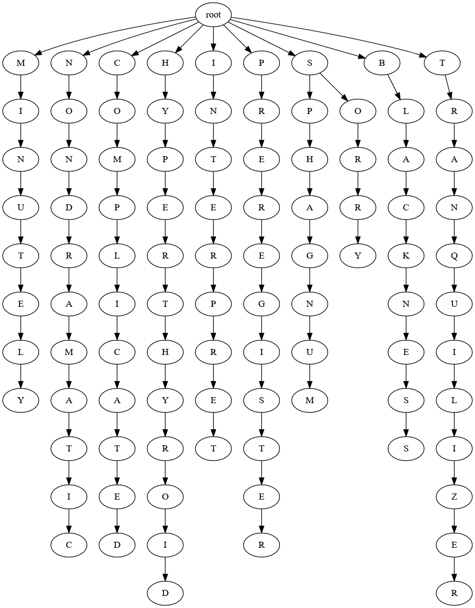
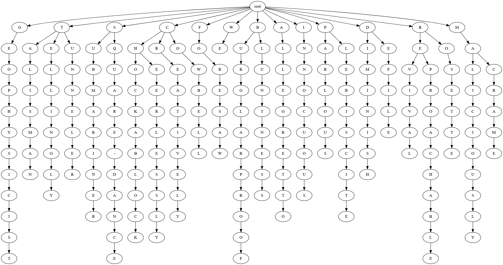
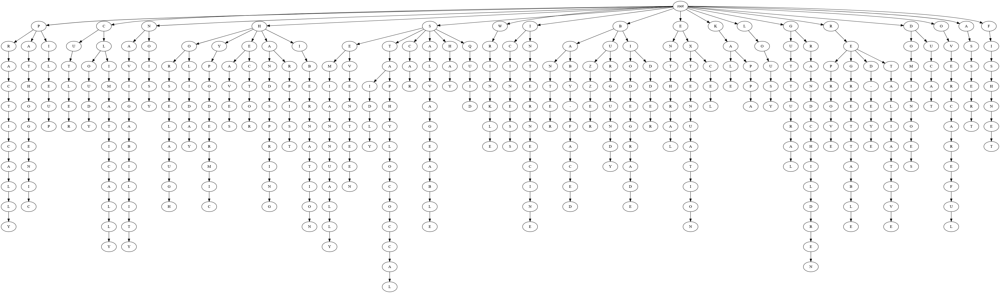

<h1 align="center">CSCTrie</h1>
<h2 align="center">CSC212 Final Project Trie</h2>

This is the main README.md for our final project.Dependencies, there are not really any.  C++11 and the source code.  The english.txt should be placed "../Trie/english.txt" from where the executable is.  
It happened to be where our source code was.
  

This is probably slightly unorthodox, but we decided to rewrite our entire implementation.  Our original implementations consisted of c-style strings.  
This proved to be pragmatic when trying input sizes above 20000 or so.  We are not sure why we were getting those results but at the time we decided a different approach would probably be better.  
We switched to the obvious choice of using the SDL and had our inputs be strings not cstrings.  We used an input file that consisted of 42000+ English language words that we pushed into a Dictionary 
container.  Now in a poor attempt to be more memory conscience we decided to store our nodes in an unordered_map.  This seemed like a good idea because the key-value pairs seemed like the perfect 
container to store nodes.  For example the key was the char and the value was the pointer to the corresponding Trie node.  This worked as a Trie but using iterators to print a dotfile ended up being a 
failure.  We could not think of a way to parse multiple key-value pairs using iterators.  The intended plan was  

>node iterator.second[label=”iterator.first”]  ->   next node and so on.

Our attempts to do this successfully proved futile when we tried both iteratively and recursively.  So, we rewrote the entire data structure with the same approach but using an array of pointers to 
Trie nodes (of size 128, ASCII’s defined size) and having the input char be the key to the array (probably the most sensible approach in hindsight).  Now this worked, albeit late.  
However, it is done, the dotfiles look great and the actual formatting of the dotfiles are neat.  

The new version outputs 3 dotfiles of input size 10, 25 and 50.  Also it outputs 5 .m files used for graphing in matlab.  The graphs consist of a 10 input graph that compared input length and 
insertion time and standard deviation of input length and insertion time.  Also, a 10 input search against time.  It outputs the same files for an input size of 50.  It also outputs the 
summation of insertion time against 42000+ inputs.  As a disclaimer the dotfiles are in .txt format just for ease of copying and pasting into a graphiviz web app.  Changing that to a dotfile
 is as simple as changing the fstream constructor input from “somefilename.txt” to “somefilename.dot”.  
 
 

>These dotfiles are outdated but just an example of what they did look like in their rudimentary form. see [DOT_IMAGES.md](https://github.com/Hollands09/CSCTrie/blob/main/DOT_IMAGES.md) 

>10 input Trie  

 

>25 input Trie 

 

>50 input Trie

