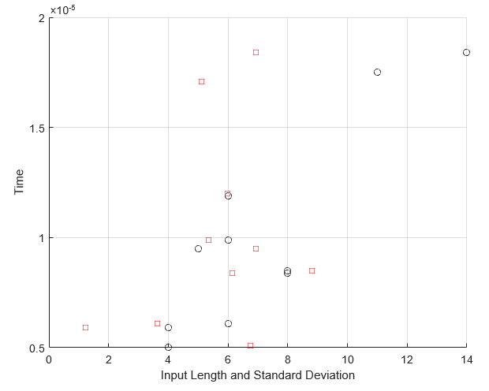
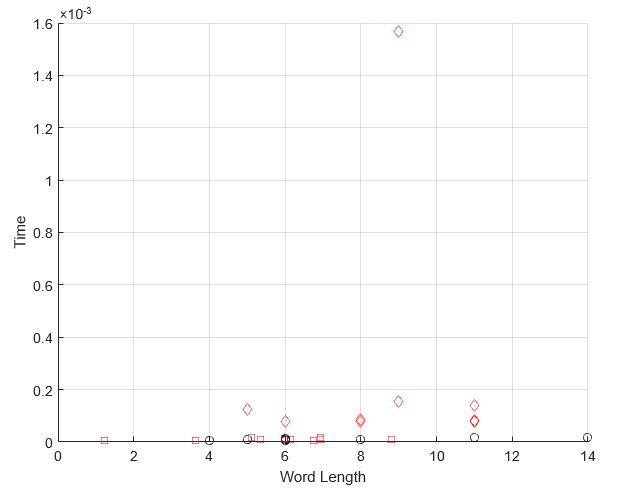
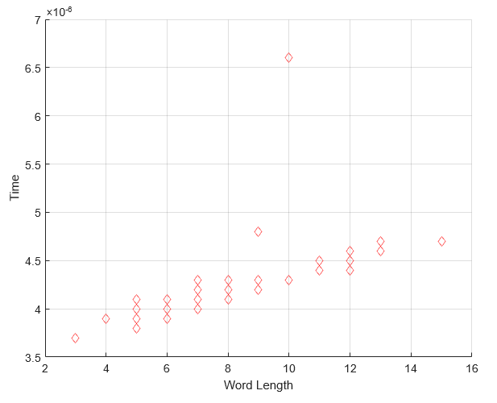
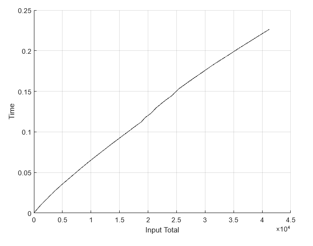

<h1 align="center">CSCTrie</h1>
<h2 align="center">Runtime of Search and Insert</h2>

The graphs shown are were made in MATLAB using the code out program output.  The graphs for the 10 input insert show word length vs time and standard deviation of the characters (how difference the ASCII values are)
vs time.  Word length are black circles and the standard deviation are shown as red diamonds.  The search for 10 inputs shows the same data compared to the search algorithm run time.
The 50 input shows the word length vs time and standard deviation vs time while the search only shows the word length vs time.  For the last graph, the entire dictionary was inserted and then
each input is compared to the summation of time until that point.  This will show a roughly linear graph.  Links to the dotfile and the .m files will be included under the graph to see what words were input
if that is something that is of interest.
 

>10 insertions [dotfile](https://github.com/Hollands09/CSCTrie/tree/main/img/10dotfilegraph.txt) , [insert.m](https://github.com/Hollands09/CSCTrie/tree/main/img/10insertTime.m) , [search.m](https://github.com/Hollands09/CSCTrie/tree/main/img/10searchTime.m)

 
 

>50 insertions [dotfile](https://github.com/Hollands09/CSCTrie/tree/main/img/50dotfilegraph.txt) , [insert.m](https://github.com/Hollands09/CSCTrie/tree/main/img/50insertTime.m) , [search.m](https://github.com/Hollands09/CSCTrie/tree/main/img/50searchTime.m)

 
 

>40k+ insertions [insert.m](https://github.com/Hollands09/CSCTrie/tree/main/img/40ThouinsertTime.m)

 
 

